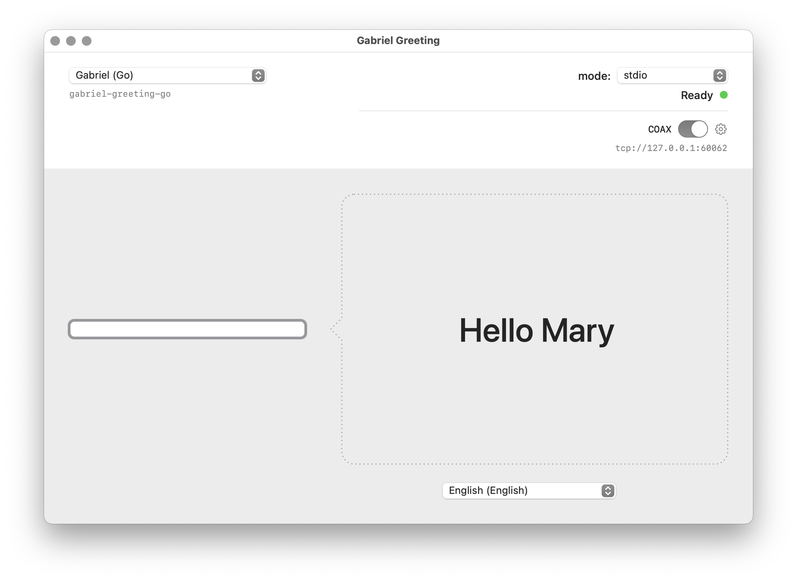

# COAX

**COAX** (coaccessibility) is the design principle that every **holon**[^1]
follows: expose the same structural contracts to humans and machines
alike. No special agent API, no separate admin interface — one surface,
universally accessible through  innate facets Code API, CLI, RPC, Test, (and acquired facets MCP, SKILLS, Sequences)

[^1]:> A **holon** is, at any scale, an independent, composable, software functional unit built for [**coaccessibility** (**COAX**)](COAX.md) — equally accessible to humans and machines (agents, CI, LLM) through the same structural contracts. — [CONSTITUTION.md Article 1](./CONSTITUTION.md#article-1--the-holon)

---
# Organism

An **organism** is an application — standalone or distributed — built
from holons and coaccessible by design.

It can be a **standalone app** (a SwiftUI desktop app, an Android app,
a CLI tool) or a **distributed system** (a cloud service, a multi-node
pipeline). What makes it an organism is not where it runs, but what it
exposes: any agent, CI pipeline, LLM, or human can interact with it
naturally through its structural contracts — RPC, CLI, MCP — without
adaptation layers or special integrations.

An organism is not required to expose all its members. `ListMembers`
may intentionally omit internal holons — the organism controls its
exposure surface, keeping its external interface minimal while its
internal composition can be arbitrarily complex.

Every organism is a holon, but not every holon is an organism.
A leaf holon (e.g. `gabriel-greeting-go`) serves RPCs but has no members.
An organism (e.g. `gabriel-greeting-app-swiftui`) composes member holons
and makes the *whole system* coaccessible as one living unit. When the
organism has a UI, agent calls and human interactions share the same
observable state. The single source of truth is the organism's `.proto`
— it imports the foundation protos (`describe.proto`, `coax.proto`) and
adds its own domain services on top.

## Concretely, how does it work?

### What happens when you use **op**[^2] to interact with an organism?

[^2]: `op` is the Organic Programming CLI orchestrator. See [OP.md](./holons/grace-op/README.md).


1. You have launched [gabriel-greeting-app-swiftui](./examples/hello-world/gabriel-greeting-app-swiftui/) either by clicking on the app icon or by calling `op run gabriel-greeting-app-swiftui`. 
2. You have enabled COAX by toggling it (it is worth noting that enabling COAX is an opt-in, as it exposes the organism).

#### Initial state of the app  




#### You call **op Greet Bob** on the organism 

```shell
$ op tcp://127.0.0.1:60000 Greet '{"name":"Bob"}'
{
  "greeting": "Hello Bob"
}
```

#### State of the app after the call 


#### Detailed step by step :

1. **OP CLI dispatch** — `op` parses `grpc+tcp://127.0.0.1:60000` as a gRPC URI.
   [commands.go](./internal/cli/commands.go) → `cmdGRPC` → `cmdGRPCDirect`
   since `127.0.0.1:60000` is a `host:port` target.

2. **OP TCP dial** — [client.go](./internal/grpcclient/client.go) → `Dial`
   opens a standard gRPC/HTTP2 connection over TCP to the organism exposed
   by gabriel-greeting-app-swiftui.

3. **OP sends Describe RPC** — [client.go](./internal/grpcclient/client.go) → `InvokeConn`
   tries `invokeViaDescribe` first  
   [describe_catalog.go](./internal/grpcclient/describe_catalog.go) → `fetchDescribeCatalog`
   calls `HolonMeta/Describe` on the organism.

4. **Organism receives Describe** — The Swift app's in-process gRPC server
   ([CoaxServer.swift](../../examples/hello-world/gabriel-greeting-app-swiftui/Modules/Sources/GreetingKit/CoaxServer.swift))
   routes the call to
   [CoaxDescribeProvider.swift](../../examples/hello-world/gabriel-greeting-app-swiftui/Modules/Sources/GreetingKit/CoaxDescribeProvider.swift) → `describe`.
   It returns a pre-built `DescribeResponse` containing the full schema for
   two services: `holons.v1.CoaxService` (member management) and
   `greeting.v1.GreetingAppService` (domain actions: `SelectHolon`,
   `SelectLanguage`, `Greet`), with all field definitions, types, and examples.

5. **OP builds a catalog** — [describe_catalog.go](./internal/grpcclient/describe_catalog.go) → `buildDescribeCatalog`
   indexes every method from the `DescribeResponse` into a lookup table
   (`byExact` for fully-qualified names, `byName` for short names). The catalog
   is cached per connection for subsequent calls.

6. **OP resolves the method Greet** — `catalog.resolve("Greet")` looks up
   `"Greet"` by short name, finds a single match in
   `greeting.v1.GreetingAppService`, and returns the `describeMethod` binding
   with the full gRPC path `/greeting.v1.GreetingAppService/Greet` and the
   `MethodDoc` field definitions (`name: string`, `lang_code: string`).

7. **OP builds synthetic descriptors** — `method.descriptors()` lazily builds
   real `protoreflect.MessageDescriptor` objects from the `MethodDoc` field
   definitions. `syntheticProtoBuilder` constructs a `FileDescriptorProto` with
   `GreetRequest` / `GreetResponse` message types, then compiles it via
   `protodesc.NewFiles` into proper protobuf descriptors — the same kind
   produced by `protoc` at compile time.

8. **OP JSON → dynamic protobuf message** — `protojson.Unmarshal` parses the CLI
   JSON `{"name":"Bob"}` into a `dynamicpb.Message` backed by the synthetic
   `GreetRequest` descriptor.

9. **OP gRPC invoke (binary protobuf on the wire)** — `conn.Invoke` sends the
   request as **standard binary protobuf** over HTTP/2 to the organism.

10. **Organism receives the Greet RPC** — The gRPC server dispatches the call to
    [GreetingAppServiceProvider.swift](./examples/hello-world/gabriel-greeting-app-swiftui/Modules/Sources/GreetingKit/GreetingAppServiceProvider.swift) → `greet`.
    The handler runs on `@MainActor` (the main thread), and:

    - Sets `holon.userName = "Bob"` — because `HolonProcess` is an
      `@ObservableObject`, this **immediately updates the SwiftUI text field**
      in
      [ContentView.swift](./examples/hello-world/gabriel-greeting-app-swiftui/App/ContentView.swift).
      The name "Bob" appears in the input field in real time.
    - If `lang_code` is provided, sets `holon.selectedLanguageCode` accordingly
      (which updates the language picker in the UI).

11. **Organism delegates to the child holon** — The handler calls
    `holon.sayHello(name: "Bob", langCode: langCode)` →
    [HolonProcess.swift](./examples/hello-world/gabriel-greeting-app-swiftui/Modules/Sources/GreetingKit/HolonProcess.swift) → `sayHello`
    which forwards the request to the **currently connected child holon**
    (e.g. `gabriel-greeting-go`, `gabriel-greeting-rust`, etc.) via
    [GreetingClient.swift](./examples/hello-world/gabriel-greeting-app-swiftui/Modules/Sources/GreetingKit/GreetingClient.swift) → `sayHello`.
    This is a second gRPC call — from the Swift app to the holon subprocess
    over stdio or tcp, using compiled protobuf stubs
    (`/greeting.v1.GreetingService/SayHello`).

12. **Child holon responds** — The selected holon (e.g. gabriel-greeting-go)
    processes the `SayHello` request and returns the localized greeting text
    (e.g. `"Hello, Bob!"`).

13. **Organism updates the UI** — Back in `GreetingAppServiceProvider.greet()`, the
    handler sets `holon.greeting = greeting` on `@MainActor`. Because
    `HolonProcess.greeting` is `@Published`, **SwiftUI instantly updates the
    speech bubble** in `ContentView.bubbleColumn` — the greeting appears on
    screen.

14. **Organism returns response to OP** — The `GreetResponse` (containing the
    greeting string) is serialized as binary protobuf and sent back over TCP
    to `op`.

15. **OP receives response** — gRPC unmarshals the binary protobuf into
    `outputMsg` (a `dynamicpb.Message` backed by the synthetic `GreetResponse`
    descriptor).

16. **OP formats output** — `protojson.Marshal` converts the response back to
    JSON. `newCallResult` pretty-prints it for display in the terminal.

> **Key insight**: The COAX call produces **two visible effects simultaneously**:
> the terminal displays the JSON response, and the SwiftUI app updates its UI
> in real time (name field + greeting bubble). This happens because the organism's
> handler mutates the same `@Published` state that the UI observes — the agent
> and the human share a single source of truth.

### How to use gRPC directly on an organism?

You can bypass `op` entirely and use standard gRPC tools like
[grpcurl](https://github.com/fullstorydev/grpcurl). You need to provide the
proto files so `grpcurl` knows the schema — unlike `op`, it does not use
`Describe` for dynamic discovery.

The proto import graph requires two include paths:

| Import path | Contains |
|---|---|
| `_protos/` | [coax.proto](./_protos/holons/v1/coax.proto), [describe.proto](./_protos/holons/v1/describe.proto), [manifest.proto](./_protos/holons/v1/manifest.proto) |
| `examples/_protos/` | [greeting.proto](./examples/_protos/v1/greeting.proto) |

The app's contract is defined in
[holon.proto](./examples/hello-world/gabriel-greeting-app-swiftui/api/v1/holon.proto),
which imports from both paths.

> **No reflection** — COAX organisms intentionally do not enable gRPC reflection.
> `grpcurl list` will fail with `server does not support the reflection API`.
> This is by design: holons use `HolonMeta/Describe` instead — a curated,
> documented schema with examples, field descriptions, and semantic metadata
> that reflection does not provide.

#### Call Describe (same RPC that `op` uses internally)

```shell
$ grpcurl -plaintext \
    -import-path _protos \
    -proto holons/v1/describe.proto \
    127.0.0.1:60000 holons.v1.HolonMeta/Describe
```

#### List available member holons

```shell
$ grpcurl -plaintext \
    -import-path _protos \
    -proto holons/v1/coax.proto \
    127.0.0.1:60000 holons.v1.CoaxService/ListMembers
```

#### Connect a member holon

```shell
$ grpcurl -plaintext \
    -import-path _protos \
    -proto holons/v1/coax.proto \
    -d '{"slug":"gabriel-greeting-go"}' \
    127.0.0.1:60000 holons.v1.CoaxService/ConnectMember
```

#### Greet (domain RPC)

```shell
$ grpcurl -plaintext \
    -import-path _protos \
    -import-path examples/_protos \
    -import-path examples/hello-world/gabriel-greeting-app-swiftui \
    -proto api/v1/holon.proto \
    -d '{"name":"Bob"}' \
    127.0.0.1:60000 greeting.v1.GreetingAppService/Greet
```

> **Note**: With `grpcurl` you must use the **fully-qualified** method name
> (e.g. `greeting.v1.GreetingAppService/Greet`), whereas `op` resolves short
> names like `Greet` automatically via `Describe`.

