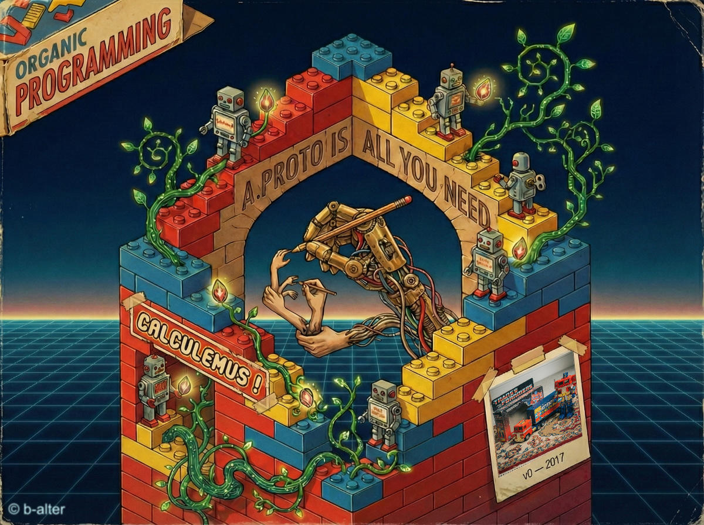

# Organic Programming

A bio-inspired, Unix-inspired paradigm for a hybrid human–agent world.
A `.proto` at the center, facets radiating from it — and legacy code,
new code, humans, and agents naturally interoperate.

> For the full motivation, see [Why?](./WHY.md).
> For the full specification, see [AGENT.md](./AGENT.md).

---

## Core ideas

### The Holon[^1]

A **holon** is an independent, composable functional unit at any scale.
A proto + facets is all you need.

The `.proto` file is the **gravitational center** — not a facet, but
the source from which all facets derive.

**Innate facets** — code the developer writes, each delegating to the
generated stubs:

- **Code API** — pure functions, no I/O. The single source of truth
  for business logic.
- **CLI** — `stdin`/`stdout` bridge to scripts, CI, and humans.
- **RPC** — gRPC service, SDK-managed serving and shutdown.
- **Tests** — the executable specification.

**Golden rule — surface symmetry**: all four innate facets cover the
same external surface (`Code API = CLI = RPC = Tests`). Keep this
surface minimal; the internal volume can be as complex as needed.

**Acquired facets** — traits gained through `op`, zero code required:

- **MCP** — individual RPCs exposed as MCP tools for LLM clients.
- **Skills** — declared capabilities discoverable by agents.
- **Sequences** — deterministic multi-step workflows from the holon's
  RPCs.

### The Contract[^2]

The `.proto` file is the single source of truth for a holon's public
surface. Every public function is an `rpc`. Every type is a `message`.
`protoc` generates native stubs in every target language; the human
never writes API plumbing by hand.

### Composition[^3]

*"Expect the output of every holon to become the input to another,
as yet unknown, holon."*

Holons compose at three levels:
1. **In-process** — via the Code API facet, no serialization.
2. **At runtime** — via serve & dial, any transport.
3. **At the shell** — classic CLI piping.

### Mimesis[^4]

*"Invent only what is truly new; for everything else, imitate what
works."*

Replicate mechanisms that have survived natural selection in other
ecosystems, then adapt them to the holon substrate.

### Serve & Dial[^5]

Every holon can **serve** (listen for calls) and **dial** (call another
holon) — simultaneously, on any transport (TCP, stdio, Unix socket,
WebSocket, in-memory). Two holons from different technology stacks
interlock like Lego bricks: one serves, the other dials.

### Try it

These ideas are not theoretical

### Examples

[SwiftUI Organism](./examples/hello-world/gabriel-greeting-app-swiftui/) — composite organism: recipe-driven build, COAX interaction, and native macOS host UI.

 — the reference implementation
- [C](./examples/hello-world/gabriel-greeting-c/)
- [C++](./examples/hello-world/gabriel-greeting-cpp/)
- [C#](./examples/hello-world/gabriel-greeting-csharp/)
- [Dart](./examples/hello-world/gabriel-greeting-dart/)
- [Java](./examples/hello-world/gabriel-greeting-java/)
- [Kotlin](./examples/hello-world/gabriel-greeting-kotlin/)
- [Node](./examples/hello-world/gabriel-greeting-node/)
- [Python](./examples/hello-world/gabriel-greeting-python/)
- [Ruby](./examples/hello-world/gabriel-greeting-ruby/)
- [Rust](./examples/hello-world/gabriel-greeting-rust/)
- [Swift](./examples/hello-world/gabriel-greeting-swift/)

SDKs and toolchain:

- **[sdk/](./sdk/)** — language SDKs (`serve`, `transport`, `identity`, `discover`, `connect`)
- **[holons/grace-op/](./holons/grace-op/)** — the `op` orchestrator

---

# This Seed

This repository is the **seed** — the foundational specification from
which the ecosystem grows.

| Document | What it answers |
|----------|----------------|
| [Constitution](./AGENT.md) | What is a holon? |
| [Coax](./COAX.md)| coaccessibility. |
| [Conventions](./CONVENTIONS.md) | How is a holon structured per language? |
| [Holon discovery](./holons/grace-op/HOLON_DISCOVERY.md) | How do holons discover each other? |
| [Holon build](./holons/grace-op/HOLON_BUILD.md) | How do holons build each other? |
| [.proto](./holons/grace-op/HOLON_PROTO.md) | How do holons use protos? |
| [Holon package](./holons/grace-op/HOLON_PACKAGE.md) | How do holons package each other? |
| [OP](./holons/grace-op/README.md) |  Op is the CLI tool. |
| [Protocol](./PROTOCOL.md) | How do holons communicate? |

© 2026 Benoit Pereira da Silva. All rights reserved.

---

[^1]: See [AGENT.md — Article 1](./AGENT.md#article-1--the-holon)
[^2]: See [AGENT.md — Article 2](./AGENT.md#article-2--the-contract-protocol-buffers)
[^3]: See [AGENT.md — Article 5](./AGENT.md#article-5--composition)
[^4]: See [AGENT.md — Article 9](./AGENT.md#article-9--mimesis)
[^5]: See [AGENT.md — Article 11](./AGENT.md#article-11--the-serve--dial-convention)
