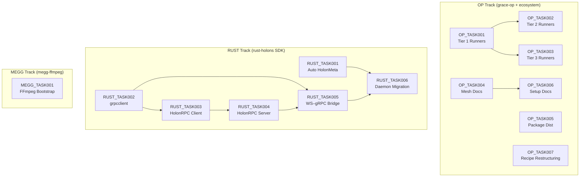

# Design Roadmap

Execution order for all design tasks. Tasks within the same phase can run in parallel unless a dependency arrow states otherwise.

## Dependency Graph

---

## Execution Phases

### Phase 1 — Foundations (no dependencies)

| Task | Track | Summary |
|---|---|---|
| [OP_TASK001](./OP_TASK001_tier1_runners.md) | OP | `cargo`, `swift-package`, `flutter` runners for grace-op |
| [OP_TASK004](./OP_TASK004_mesh_documentation.md) | OP | Document `op mesh` + transport security in spec docs |
| [OP_TASK005](./OP_TASK005_op_package_distribution.md) | OP | Package manager distribution for `op` CLI |
| [OP_TASK007](./OP_TASK007_recipe_restructuring.md) | OP | Restructure recipes into `ui/` + `composition/` |
| [RUST_TASK001](./RUST_TASK001_auto_holonmeta.md) | RUST | Auto-register `HolonMeta.Describe` in `serve::run()` |
| [RUST_TASK002](./RUST_TASK002_grpcclient.md) | RUST | `grpcclient` module (WebSocket + mem dial) |
| [MEGG_TASK001](./MEGG_TASK001_ffmpeg_bootstrap.md) | MEGG | Bootstrap `megg-ffmpeg` C++ holon |

### Phase 2 — Dependent work

| Task | Track | Depends on | Summary |
|---|---|---|---|
| [OP_TASK002](./OP_TASK002_tier2_runners.md) | OP | OP_TASK001 | `npm`, `gradle` runners |
| [OP_TASK003](./OP_TASK003_tier3_runners.md) | OP | OP_TASK001 | `dotnet`, `qt-cmake` runners |
| [OP_TASK006](./OP_TASK006_op_setup_documentation.md) | OP | OP_TASK004 | Document `op setup` + `setup.yaml` spec |
| [RUST_TASK003](./RUST_TASK003_holonrpc_client.md) | RUST | RUST_TASK002 | JSON-RPC 2.0 HolonRPC client |

### Phase 3 — Higher-level features

| Task | Track | Depends on | Summary |
|---|---|---|---|
| [RUST_TASK004](./RUST_TASK004_holonrpc_server.md) | RUST | RUST_TASK003 | HolonRPC server + fanout routing |

### Phase 4 — Integration

| Task | Track | Depends on | Summary |
|---|---|---|---|
| [RUST_TASK005](./RUST_TASK005_ws_grpc_bridge.md) | RUST | RUST_TASK002, RUST_TASK004 | WebSocket-to-gRPC bridge in `serve.rs` |

### Phase 5 — Migration

| Task | Track | Depends on | Summary |
|---|---|---|---|
| [RUST_TASK006](./RUST_TASK006_daemon_migration.md) | RUST | RUST_TASK001–005 | Migrate all 6 Rust recipe daemons to SDK |

---

## Design Documents

These are reference material used by the tasks above — not tasks themselves.

| Document | Referenced by |
|---|---|
| [DESIGN_op_mesh.md](./DESIGN_op_mesh.md) | OP_TASK004 |
| [DESIGN_op_setup.md](./DESIGN_op_setup.md) | OP_TASK006 |
| [DESIGN_public_holons.md](./DESIGN_public_holons.md) | OP_TASK004 |
| [DESIGN_transport_rest_sse.md](./DESIGN_transport_rest_sse.md) | OP_TASK004 |

---

## Track Independence

The three tracks (OP, RUST, MEGG) are **fully independent** and can progress in parallel. Within each track, follow the phase order above.
