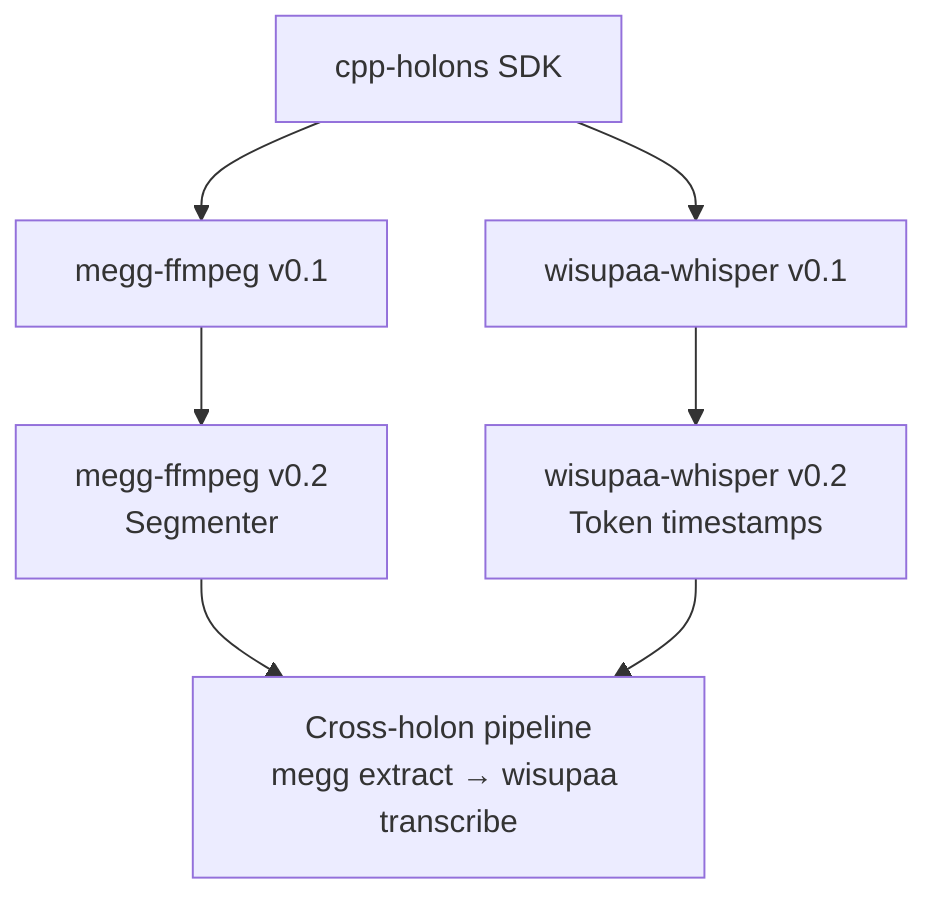

# C++ Holons — Joint Planning

> Megg (FFmpeg) and Wisupaa (Whisper) are the two C++ holons in the Organic
> Programming ecosystem. They share infrastructure, complement each other, and
> should be planned together.

---

## The Two Holons

| | Megg (FFmpeg) | Wisupaa (Whisper) |
|---|---|---|
| **Motto** | *"Transform any stream."* | *"Every sound becomes data."* |
| **Clade** | deterministic/media | probabilistic/perceptual |
| **Engine** | FFmpeg 8.0.1 (libav* stack) | whisper.cpp (OpenAI Whisper) |
| **Primary role** | Media processing, format conversion, analysis | Speech-to-text, language detection, VAD |
| **Model dependency** | None (codecs are compiled in) | Requires .bin model file at runtime |
| **License** | LGPL/GPL (FFmpeg) | MIT (whisper.cpp) |

---

## Shared Infrastructure

Both holons share identical scaffolding. This should be built once and
replicated:

```
holons/<name>/
├── holon.yaml                    ← OP manifest
├── HOLON.md                      ← Identity + motto
├── CMakeLists.txt                ← Builds third_party + service + CLI
├── protos/<service>/v1/*.proto   ← RPC contract
├── third_party/<engine>/         ← Git submodule (FFmpeg or whisper.cpp)
├── src/
│   ├── <service>_service.h       ← Public API
│   ├── <service>_service.cpp     ← Implementation
│   ├── raii_wrappers.h           ← RAII for C APIs
│   └── types.h                   ← Request/response structs
├── cmd/<binary>/main.cpp         ← JSON-RPC dispatcher
└── tests/
    ├── test_<service>.cpp        ← Unit + integration tests
    └── fixtures/                 ← Test media / audio
```

### Shared C++ Patterns

| Pattern | Both holons use |
|---------|----------------|
| `cpp-holons` SDK | `holons.hpp` for JSON-RPC, `serve.hpp` for gRPC |
| `nlohmann/json` | Request/response serialization |
| CMake `ExternalProject_Add` | Build third_party from source |
| RAII wrappers | Custom deleters for C API types |
| C++20 | `std::filesystem`, structured bindings, `std::optional` |
| stdio transport | Default for `connect(slug)` |

---

## Wisupaa-Whisper — Current State

**Status:** Design exists but repo was archived during v0.4.3 cleanup.
The `design/wisupaa-whisper/v0.1/` folder is empty. KI documents the
architecture but implementation needs to be rebuilt.

### Existing KI Capabilities

| Capability | whisper.cpp feature | Status |
|-----------|-------------------|--------|
| Transcription | `whisper_full()` | Designed, not implemented |
| Language detection | `whisper_lang_auto_detect()` | Designed, not implemented |
| Model introspection | `whisper_model_*()` functions | Designed, not implemented |
| VAD | `whisper_params.vad` | Available in whisper.cpp, not yet in design |
| Token timestamps | `whisper_full_get_token_data()` | Available, not yet in design |
| Quantization | Q4/Q5/Q8 model variants | Runtime choice, no design needed |

### whisper.cpp Engine Capabilities (2025+)

| Feature | API | Notes |
|---------|-----|-------|
| Core transcription | `whisper_full()`, `whisper_full_parallel()` | Single-pass or parallel |
| Streaming / real-time | `whisper_full()` with audio chunks | Slide window over live audio |
| Voice Activity Detection | `whisper_params.vad = true` | Silence skip, improves accuracy |
| GPU acceleration | Metal (macOS), Vulkan, CUDA | Via compile flags |
| Quantization | Model variants (Q4_0, Q5_1, Q8_0) | 2-4x smaller, ~same accuracy |
| Speaker diarization | Community patches, not upstream | Experimental |
| Token-level timing | `whisper_full_get_token_data()` | Word-level timestamps |
| Language auto-detect | `whisper_lang_auto_detect()` | Returns lang code + confidence |
| Translate mode | `whisper_params.translate = true` | Any language → English |

---

## Wisupaa-Whisper — Proposed Roadmap

| Version | Theme | Key RPCs |
|---------|-------|---------|
| **v0.1** | Bootstrap | Build + Transcribe + DetectLanguage + GetVersion |
| **v0.2** | Precision | Token timestamps, forced alignment, custom prompts |
| **v0.3** | Streaming | Real-time transcription (chunked audio input) |
| **v0.4** | Intelligence | VAD, speaker diarization (experimental), translate |
| **v0.5** | Performance | GPU acceleration (Metal/Vulkan/CUDA), quantized models |
| **v1.0** | Production | Stability, benchmarks, CI, model management |

### v0.1 RPCs

| RPC | whisper.cpp API | Description |
|-----|----------------|-------------|
| `Transcribe` | `whisper_full()` | Audio file → timestamped text segments |
| `DetectLanguage` | `whisper_lang_auto_detect()` | Audio → language code + confidence |
| `GetModelInfo` | `whisper_model_*()` | Model name, size, languages, features |
| `GetVersion` | compile-time | whisper.cpp version + build config |

### v0.1 Proto

```protobuf
syntax = "proto3";
package whisper.v1;

service Whisper {
  rpc Transcribe(TranscribeRequest) returns (TranscribeResponse);
  rpc DetectLanguage(DetectLanguageRequest) returns (DetectLanguageResponse);
  rpc GetModelInfo(GetModelInfoRequest) returns (GetModelInfoResponse);
  rpc GetVersion(GetVersionRequest) returns (GetVersionResponse);
}

message TranscribeRequest {
  string audio_path = 1;          // Path to audio file (WAV, MP3, etc.)
  string language = 2;            // BCP-47 code or empty for auto-detect
  string model_path = 3;          // Path to .bin model file
  bool word_timestamps = 4;       // Token-level timing
  int32 threads = 5;              // 0 = auto
}

message TranscribeResponse {
  repeated Segment segments = 1;
  string detected_language = 2;
  double processing_time_s = 3;
}

message Segment {
  double start_s = 1;
  double end_s = 2;
  string text = 3;
  double confidence = 4;            // Segment-level confidence (log probability)
  repeated Token tokens = 5;        // Only if word_timestamps=true
}

message Token {
  double start_s = 1;
  double end_s = 2;
  string text = 3;
  double probability = 4;
}
```

---

## FFmpeg 8.0 Whisper Filter — Overlap Analysis

FFmpeg 8.0 includes a built-in `whisper` audio filter. This creates
interesting overlap:

| Capability | megg (via FFmpeg filter) | wisupaa (native) |
|-----------|------------------------|-----------------|
| Basic transcription | ✅ `whisper` filter | ✅ `whisper_full()` |
| Word-level timestamps | ❌ | ✅ Token timestamps |
| Model selection | Limited (defaults) | Full control |
| VAD | ❌ | ✅ |
| Language detection | Basic | ✅ with confidence |
| Streaming | ✅ (filter graph) | ✅ (chunked) |
| GPU accel | Via FFmpeg (limited) | Native Metal/Vulkan/CUDA |
| Forced alignment | ❌ | ✅ (with custom prompts) |

**Conclusion:** megg's Whisper filter is sufficient for casual/live
subtitle embedding. wisupaa is for precision transcription, alignment,
and advanced ASR pipelines. They complement, not compete.

---

## Joint Codex Strategy

### Phase 1: Shared Foundation (build once, use twice)

Create the common scaffolding that both holons need:

| Deliverable | Used by |
|------------|---------|
| CMakeLists.txt template (ExternalProject) | Both |
| RAII wrapper header (`raii_wrappers.h`) | Both |
| JSON-RPC dispatcher pattern (`main.cpp`) | Both |
| Test fixture generator script | Both |
| `holon.yaml` template | Both |

### Phase 2: Megg v0.1 (Codex prompts P1–P5)

Megg is the simpler target — no model files needed, deterministic behavior.
Build it first to validate the shared patterns.

### Phase 3: Wisupaa v0.1 (Codex prompts W1–W4)

| Prompt | Scope |
|--------|-------|
| **W0** (us) | Bootstrap: holon.yaml, proto, CMakeLists, test audio fixture |
| **W1** (Codex) | RAII wrappers for whisper.cpp types + `Transcribe` RPC |
| **W2** (Codex) | `DetectLanguage` + `GetModelInfo` + `GetVersion` |
| **W3** (Codex) | JSON-RPC dispatcher |
| **W4** (Codex) | Tests (requires a small Whisper model in fixtures) |

### Phase 4: Integration Tests

Cross-holon test: megg extracts audio → wisupaa transcribes it.
This validates the full pipeline and proves holonic composability.

---

## Risk Comparison

| Risk | Megg | Wisupaa |
|------|------|---------|
| Build complexity | **High** (FFmpeg 5–15 min) | **Medium** (whisper.cpp 2–5 min) |
| Binary size | **High** (50–100 MB) | **Medium** (10–30 MB) |
| Model dependency | None | **Requires .bin file** (>100 MB for base) |
| API stability | FFmpeg deprecates aggressively | whisper.cpp API is simpler, more stable |
| GPU accel complexity | HW-specific configure flags | Compile flag only (Metal/Vulkan/CUDA) |
| Test fixtures | Small (generate via ffmpeg) | **Needs Whisper model** for integration tests |

---

## Dependency Graph



---

## Order of Work

1. **Write shared CMakeLists template** (ExternalProject pattern)
2. **Create wisupaa-whisper design folder** (ROADMAP, v0.1 tasks, INDEX)
3. **Generate P0/W0 bootstrap files** for both holons
4. **Send megg P1 to Codex** (simpler, validates shared patterns)
5. **If megg P1 succeeds → send wisupaa W1** (same pattern, different engine)
6. **Iterate P2–P5 / W2–W4** in parallel
