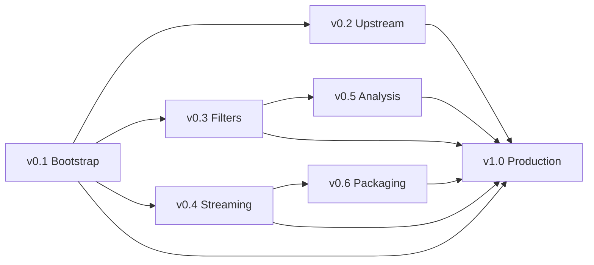

# Megg FFmpeg — Master Roadmap

> *"Transform any stream."*

Megg is a **C++ holon** wrapping FFmpeg's full `libav*` stack. It exposes
task-oriented media RPCs over JSON-RPC and serves as the low-level media
workhorse for any Organic Programming pipeline that touches audio/video.

---

## Why a Versioned Roadmap?

FFmpeg is an enormous library (100+ codecs, 40+ muxers, filters, HW accel,
network protocols). Building a useful holon incrementally avoids the trap of
exposing the full API surface at once. Each version adds a coherent capability
layer that is testable and shippable on its own.

---

## Version Map

| Version | Codename | Theme | Depends on |
|---------|----------|-------|------------|
| **v0.1** | Bootstrap | Build system + 6 core RPCs | — |
| **v0.2** | Upstream | Segmenter + alignment audio prep | v0.1 |
| **v0.3** | Filters | `avfilter` graph RPCs + HW accel | v0.1 |
| **v0.4** | Streaming | Network protocols + chunk I/O | v0.1 |
| **v0.5** | Analysis | Scene detection, loudness, waveform | v0.3 |
| **v0.6** | Packaging | Adaptive streaming, DRM prep | v0.4 |
| **v1.0** | Production | Stability, perf, full platform matrix | v0.1–v0.6 |



---

## v0.1 — Bootstrap

**Status:** Designed (MEGG_TASK001)

### Goal

Compilable C++ holon with FFmpeg built from source, 8 RPCs (6 task-oriented +
`Execute` + `ExecuteProbe`), LGPL/GPL dual licensing. Full FFmpeg + ffprobe
capability surface actionable via RPC from day one.

### RPCs

| RPC | libav* | Description |
|-----|--------|-------------|
| `Probe` | avformat | Format, duration, streams, codecs |
| `ExtractAudio` | avcodec + swresample | Decode → resample → raw PCM |
| `ExtractSegment` | avformat | Time-slice remux or reencode |
| `TranscodeAudio` | avcodec + swresample | Decode → encode to target codec |
| `MuxSubtitles` | avformat | Add subtitle track to container |
| `GetVersion` | avutil | Version + build config + license + capabilities |
| `Execute` | all | Pass-through: accepts FFmpeg CLI-equivalent args, runs through libav* |
| `ExecuteProbe` | avformat + avutil | Pass-through: full ffprobe-equivalent analysis in JSON/XML/CSV |

> **`Execute` is the escape hatch.** Any FFmpeg operation that doesn't have a
> dedicated RPC is callable via `Execute` from day one. The task-oriented RPCs
> above are convenience abstractions — `Execute` ensures full coverage.

### Key Decisions

- FFmpeg as git submodule, built via CMake `ExternalProject_Add`
- LGPL default, `--config gpl` opt-in
- JSON-RPC via `cpp-holons` SDK (stdio transport)
- `Execute` + `ExecuteProbe` pass-throughs ensure full coverage from day one
- No streaming — file I/O only
- Stateless: one call = one operation

### Deliverables

- [ ] `HOLON.md` + `holon.yaml`
- [ ] `protos/media/v1/media.proto`
- [ ] `CMakeLists.txt` with FFmpeg ExternalProject
- [ ] `src/media_service.{h,cpp}` (6 RPCs)
- [ ] `cmd/megg-ffmpeg/main.cpp`
- [ ] `tests/test_media_service.cpp`
- [ ] macOS build verified

---

## v0.2 — Upstream (VideoSteno Integration)

### Goal

Expose the primitives that transcription and alignment pipelines need:
temporal segmentation with overlap, forced-alignment audio prep, and format
normalization. This version makes Megg useful for any speech-to-text or
media analysis workflow.

### New RPCs

| RPC | libav* | Description |
|-----|--------|-------------|
| `Segment` | avformat + avcodec | Split media into N-second chunks with configurable overlap. Output: list of chunk file paths + timing metadata |
| `ExtractAudioForAlignment` | avcodec + swresample | Like `ExtractAudio` but with ASR-optimized defaults: 16kHz mono f32le, silence trimming, loudness normalization |
| `DetectSilence` | avfilter (`silencedetect`) | Return silence intervals for intelligent split points |
| `NormalizeAudio` | avfilter (`loudnorm`) | EBU R128 loudness normalization |
| `ConvertFormat` | avformat | Container conversion (MKV→MP4, etc.) without reencode |

### Proto Extensions

```protobuf
// Segmenter for transcription/alignment pipelines
message SegmentRequest {
  string input_path = 1;
  double chunk_duration_s = 2;     // e.g. 30.0
  double overlap_s = 3;            // e.g. 2.0
  string output_dir = 4;
  string output_format = 5;        // "mp4", "mkv", "wav"
  bool audio_only = 6;             // Extract audio track only
}

message SegmentResponse {
  repeated ChunkInfo chunks = 1;
}

message ChunkInfo {
  int32 index = 1;
  string path = 2;
  double start_s = 3;
  double end_s = 4;
  double duration_s = 5;
}
```

### Deliverables

- [ ] `protos/media/v2/media.proto` (backward-compatible extension)
- [ ] `src/segmenter.{h,cpp}`
- [ ] `src/audio_prep.{h,cpp}` (alignment-optimized extraction)
- [ ] `src/silence_detect.{h,cpp}` (avfilter-based)
- [ ] Integration tests with real media fixtures (1-min test clip)
- [ ] Documentation: pipeline integration guide

---

## v0.3 — Filters (avfilter Graph Engine)

### Goal

Expose FFmpeg's filter graph system as a composable RPC. This unlocks video
effects, audio processing, and complex pipelines — all without shelling out
to `ffmpeg` CLI.

### New RPCs

| RPC | libav* | Description |
|-----|--------|-------------|
| `ApplyFilterGraph` | avfilter | Arbitrary filter graph applied to input |
| `GenerateThumbnail` | avfilter + swscale | Extract frame at timestamp, resize, output as PNG/JPEG |
| `GenerateWaveform` | avfilter (`showwavespic`) | Audio waveform image |
| `CropDetect` | avfilter (`cropdetect`) | Detect black bars / letterboxing |
| `ScaleVideo` | swscale | Resize video stream |

### Filter Graph API

```protobuf
message ApplyFilterGraphRequest {
  string input_path = 1;
  string output_path = 2;
  string filter_graph = 3;  // FFmpeg filter graph string
                             // e.g. "loudnorm=I=-16:TP=-1.5:LRA=11"
                             // e.g. "scale=1920:1080,fps=30"
  map<string, string> options = 4;  // Codec options for output
}
```

### Hardware Acceleration

- **macOS:** VideoToolbox encode/decode
- **Linux:** VAAPI, NVENC/NVDEC (if available)
- **Windows:** DXVA2, MediaFoundation

Configure via `OP_CONFIG`:
- `--config hwaccel=videotoolbox`
- `--config hwaccel=nvenc`
- `--config hwaccel=none` (default, pure software)

### Deliverables

- [ ] `src/filter_graph.{h,cpp}`
- [ ] `src/thumbnail.{h,cpp}`
- [ ] `src/hwaccel.{h,cpp}` (optional HW init)
- [ ] Filter graph validation and safe preset list
- [ ] Test: thumbnail extraction + waveform generation
- [ ] HW accel benchmark on macOS (VideoToolbox vs software)

---

## v0.4 — Streaming (Network Protocols + Chunk I/O)

### Goal

Move beyond file I/O. Accept and produce media over network protocols (pipe,
HTTP, RTMP, SRT). This enables Megg to participate in live pipelines where
media arrives as a stream, not a file.

### New RPCs

| RPC | libav* | Description |
|-----|--------|-------------|
| `IngestStream` | avformat (network) | Open a live stream URL, record to file or pipe chunks |
| `StreamProbe` | avformat (network) | Probe a live URL (format, codecs, bitrate) without full download |
| `PipeTranscode` | avcodec | Stdin→stdout streaming transcode (for composing with other holons) |
| `WatchFolder` | avformat | Monitor a directory, auto-probe new files |

### Transport Evolution

Move Megg from `stdio://` to **gRPC** (via `grpc-cpp`). This enables:
- Binary streaming for `PipeTranscode` (bidirectional gRPC stream)
- Concurrent RPC calls
- Better interop with Go/Dart/Swift/Kotlin clients

### Proto Extensions

```protobuf
// Streaming RPCs (gRPC only, not JSON-RPC)
rpc PipeTranscode(stream MediaChunk) returns (stream MediaChunk);

message MediaChunk {
  bytes data = 1;
  int64 pts = 2;            // Presentation timestamp (microseconds)
  bool eof = 3;
}
```

### Deliverables

- [ ] gRPC transport support (alongside existing JSON-RPC/stdio)
- [ ] `src/stream_ingest.{h,cpp}`
- [ ] `src/pipe_transcode.{h,cpp}` (bidirectional streaming)
- [ ] Network protocol whitelist (security: no `file://` from remote calls)
- [ ] Integration test: RTMP ingest → segment → probe loop

---

## v0.5 — Analysis (Media Intelligence)

### Goal

Content-aware analysis RPCs. These provide richer metadata for downstream
consumers: scene changes for intelligent segmentation, loudness maps for
compliance, waveforms for editor UIs.

### New RPCs

| RPC | libav* | Description |
|-----|--------|-------------|
| `DetectSceneChanges` | avfilter (`select`) | Scene-change timestamps with confidence scores |
| `MeasureLoudness` | avfilter (`ebur128`) | EBU R128 loudness measurement (integrated, short-term, momentary) |
| `AnalyzeSpectrum` | avfilter (`aspectralstats`) | Frequency-domain analysis for voice activity detection |
| `ExtractKeyframes` | avformat | I-frame extraction with timestamps |
| `DetectBlackFrames` | avfilter (`blackdetect`) | Black frame intervals |
| `MeasureBitrate` | avformat | Per-second bitrate profile |

### Downstream Use Cases

| RPC | Typical consumer | Why |
|-----|-----------------|-----|
| `DetectSceneChanges` | Segmenter | Intelligent split points instead of fixed 30s |
| `MeasureLoudness` | Compliance engine | Loudness compliance scoring (EBU R128) |
| `AnalyzeSpectrum` | Aligner | Voice activity detection before forced alignment |
| `ExtractKeyframes` | Editor UI | Thumbnail strip for video timeline |

### Deliverables

- [ ] `src/analysis.{h,cpp}` (all 6 RPCs)
- [ ] `protos/media/v3/analysis.proto`
- [ ] Benchmark: scene detection speed vs file duration
- [ ] Integration example: smart-split segmenter using scene detection

---

## v0.6 — Packaging (Adaptive Streaming + Distribution)

### Goal

Output-side capabilities: HLS/DASH packaging, multi-bitrate encoding ladder,
burn-in subtitles, and preparation for DRM (CPIX manifests, not encryption
itself).

### New RPCs

| RPC | Description |
|-----|-------------|
| `GenerateHLS` | Multi-bitrate HLS with master playlist |
| `GenerateDASH` | MPEG-DASH MPD + segments |
| `BurnInSubtitles` | Render subtitles directly onto video (ASS/SRT → hardcode) |
| `CreateEncodingLadder` | ABR ladder from source (e.g. 1080p/720p/480p/360p) |
| `GeneratePreview` | Low-bitrate preview proxy for editing |
| `PrepareForDRM` | Generate keyinfo / CPIX for Widevine/FairPlay |

### Encoding Ladder API

```protobuf
message EncodingLadderRequest {
  string input_path = 1;
  string output_dir = 2;
  repeated LadderRung rungs = 3;
  string video_codec = 4;     // "h264", "h265", "av1"
  string audio_codec = 5;     // "aac", "opus"
}

message LadderRung {
  int32 width = 1;
  int32 height = 2;
  int32 video_bitrate = 3;    // kbps
  int32 audio_bitrate = 4;    // kbps
  double framerate = 5;       // 0 = same as source
}
```

### Deliverables

- [ ] `src/packaging.{h,cpp}`
- [ ] HLS + DASH segment generation
- [ ] Burn-in subtitle renderer (ASS/SRT/VTT)
- [ ] ABR ladder benchmark
- [ ] DRM prep documentation

---

## v1.0 — Production

### Goal

Hardened, performant, fully cross-platform release with comprehensive tests
and documentation. No new features — this is the stabilization milestone.

### Tasks

- [ ] Full test suite (unit + integration + fuzz tests for all RPCs)
- [ ] Memory safety audit (ASAN/MSAN/TSAN pass)
- [ ] Cross-platform CI: macOS (arm64/x86_64), Linux (x86_64), Windows (MSVC)
- [ ] Performance profiling + optimization guide
- [ ] API stability freeze (v3 proto = final)
- [ ] Documentation: all RPCs, examples, VideoSteno integration cookbook
- [ ] `op build` integration: validated holon.yaml + testmatrix entry
- [ ] License audit: LGPL compliance verified, GPL codecs properly gated

---

## FFmpeg libav* Coverage Matrix

Maps each version to the FFmpeg library domains it activates:

| lib | v0.1 | v0.2 | v0.3 | v0.4 | v0.5 | v0.6 |
|-----|:----:|:----:|:----:|:----:|:----:|:----:|
| avformat | ✅ | ✅ | · | ✅ | ✅ | ✅ |
| avcodec | ✅ | ✅ | · | ✅ | · | ✅ |
| avutil | ✅ | ✅ | ✅ | ✅ | ✅ | ✅ |
| swresample | ✅ | ✅ | · | · | · | · |
| swscale | · | · | ✅ | · | · | ✅ |
| avfilter | · | ✅ | ✅ | · | ✅ | ✅ |
| avdevice | · | · | · | · | · | · |
| network | · | · | · | ✅ | · | · |

---

## Proto Versioning Strategy

| Proto file | Introduced | Contains |
|-----------|-----------|----------|
| `media/v1/media.proto` | v0.1 | Core 6 RPCs |
| `media/v2/media.proto` | v0.2 | Extends v1 + Segment, AudioPrep, Silence |
| `media/v3/analysis.proto` | v0.5 | Scene, Loudness, Spectrum, Keyframes |
| `media/v3/packaging.proto` | v0.6 | HLS, DASH, Ladder, BurnIn |

All protos are **additive** — v2 is a superset of v1. No breaking changes.

---

## Platform Build Matrix

| Platform | v0.1 | v0.2+ | Notes |
|----------|:----:|:-----:|-------|
| macOS arm64 | ✅ | ✅ | Primary dev platform, VideoToolbox HW accel |
| macOS x86_64 | ✅ | ✅ | CI-only |
| Linux x86_64 | ⚠️ | ✅ | CI + server deployment |
| Windows x86_64 | ⚠️ | ✅ | MSYS2/MinGW for configure, MSVC for compile |

⚠️ = builds are expected to work but are not CI-validated until v0.2+.

---

## Risk Register

| Risk | Impact | Mitigation |
|------|--------|------------|
| FFmpeg build time (5–15 min) | Dev velocity | Cache build artifacts, incremental rebuilds |
| GPL contamination | Legal | Strict configure flag gating, CI license check |
| Windows build complexity | Platform support | MSYS2 bootstrap script, pre-built CI images |
| Binary size (50–100 MB) | Distribution | Strip symbols, LTO, disable unused codecs |
| API stability | Downstream breakage | Proto versioning, deprecation warnings |
| Memory leaks in C API | Reliability | ASAN in CI, RAII wrappers for all av* types |
