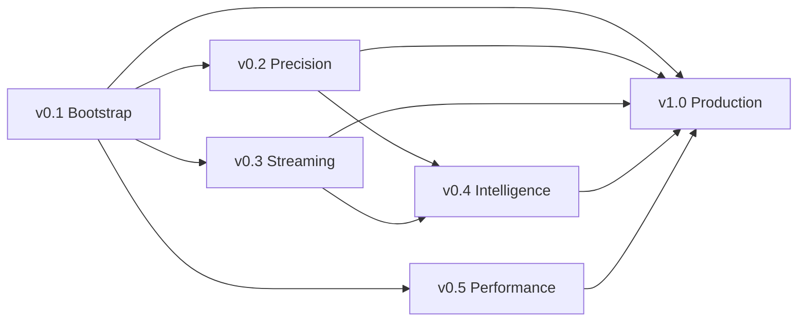

# Wisupaa Whisper — Master Roadmap

> *"Every sound becomes data."*

Wisupaa is a **C++ holon** wrapping the `whisper.cpp` engine. It exposes
precision ASR RPCs for transcription, language detection, and forced
alignment within the Organic Programming ecosystem.

---

## Version Map

| Version | Theme | Key RPCs |
|---------|-------|---------|
| **v0.1** | Bootstrap | Transcribe, DetectLanguage, GetModelInfo, GetVersion |
| **v0.2** | Precision | Token timestamps, forced alignment, custom prompts |
| **v0.3** | Streaming | Real-time transcription (chunked audio) |
| **v0.4** | Intelligence | VAD, translate mode, speaker diarization (experimental) |
| **v0.5** | Performance | GPU acceleration (Metal/Vulkan/CUDA), quantized models |
| **v1.0** | Production | Stability, benchmarks, CI, model management |



---

## v0.1 — Bootstrap

### Goal

Compilable C++ holon with whisper.cpp built from source. 4 core RPCs,
JSON-RPC over stdio. Model file provided at runtime via CLI arg.

### RPCs

| RPC | whisper.cpp API | Description |
|-----|----------------|-------------|
| `Transcribe` | `whisper_full()` | Audio file → timestamped text segments |
| `DetectLanguage` | `whisper_lang_auto_detect()` | Audio → language code + confidence |
| `GetModelInfo` | `whisper_model_*()` | Model name, type, supported languages |
| `GetVersion` | compile-time | whisper.cpp version + build config |

### Key Decisions

- whisper.cpp as git submodule in `third_party/`
- CMake build (same pattern as megg-ffmpeg)
- Model path passed via `--model /path/to/ggml-base.bin`
- MIT license (whisper.cpp is MIT)
- JSON-RPC via `cpp-holons` SDK (stdio transport)
- Audio input: WAV only in v0.1 (megg can convert anything → WAV first)

---

## v0.2 — Precision

### New/Enhanced RPCs

| RPC | Description |
|-----|-------------|
| `Transcribe` (enhanced) | Add `word_timestamps`, `initial_prompt`, `max_tokens` |
| `ForcedAlign` | Given text + audio → word-level timestamps |

### Key Feature: Custom Prompts

```protobuf
message TranscribeRequest {
  // ... existing fields ...
  string initial_prompt = 10;    // Context for better accuracy
  int32 max_tokens = 11;         // Limit output length
  double temperature = 12;        // Sampling temperature (0 = greedy)
}
```

---

## v0.3 — Streaming

### New RPCs

| RPC | Description |
|-----|-------------|
| `TranscribeStream` | Bidirectional streaming: audio chunks → partial transcripts |

### Architecture

```
Client                    Wisupaa
  │                         │
  │── AudioChunk(16kHz) ──→ │
  │                         ├── whisper_full() on sliding window
  │←── PartialResult ──────│
  │── AudioChunk ──────────→│
  │←── PartialResult ──────│
  │── EOF ─────────────────→│
  │←── FinalResult ────────│
```

Requires gRPC transport (bidirectional streaming), not JSON-RPC.

---

## v0.4 — Intelligence

### New RPCs

| RPC | Description |
|-----|-------------|
| `TranscribeWithVAD` | Silence-aware transcription (skip non-speech) |
| `Translate` | Any language → English |
| `Diarize` | Speaker identification (experimental) |

---

## v0.5 — Performance

### Focus

- GPU acceleration build flags (`WHISPER_METAL`, `WHISPER_CUBLAS`, `WHISPER_VULKAN`)
- Quantized model support (Q4, Q5, Q8 — smaller, faster, ~same accuracy)
- Benchmark suite: WER vs. speed vs. model size
- `op build --config gpu=metal` / `--config gpu=cuda` / `--config gpu=vulkan`

---

## v1.0 — Production

- Full test suite + WER benchmarks on LibriSpeech
- ASAN/TSAN pass
- Cross-platform CI (macOS arm64, Linux x86_64)
- Model download utility (`op setup wisupaa-whisper --model base`)
- Documentation + integration cookbook

---

## Compatibility & Maintenance

### whisper.cpp Version Tracking

Same policy as megg's FFmpeg tracking:

| Event | Action |
|-------|--------|
| whisper.cpp release | Update submodule within 2 weeks |
| Breaking API change | Branch, adapt, test, merge |
| New model format | Add support, keep backward compat |

### Audio Format Strategy

Wisupaa requires **16kHz mono f32le WAV** input. For any other format,
the caller should use **megg** to convert first:

```
megg.ExtractAudio(input.mp4, {sample_rate: 16000, channels: 1, format: "f32le"})
  → output.wav
wisupaa.Transcribe(output.wav)
  → segments with timestamps
```

This keeps wisupaa focused on ASR and avoids duplicating format conversion.
